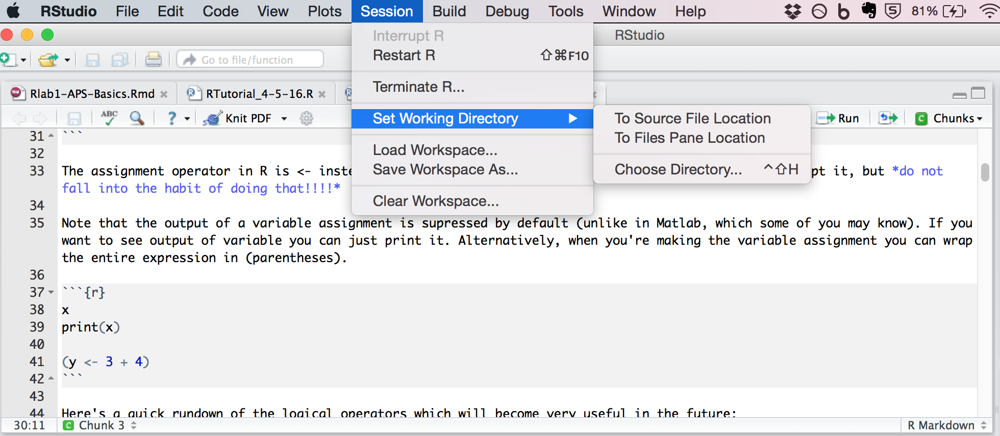

*Adapted from Anne Pier Salverda's materials for CSP 519 Spring 2016*
  
```{r setup, include = FALSE}
knitr::opts_chunk$set(echo = TRUE, fig.width = 3.5, fig.height = 3.5)
```

## 1 Preliminaries

In this lab, we will go over some basic functions that can be used to inspect
and handle data in R.  For more information about any of the functions used,
type "?function", for instance, "?mean".

## 2 Basics

Like most interpreted languages, you can type expressions directly for evaluation like so:

```{r}
1 + 1
```

However, you'll probably want to assign things to variables! 

```{r}
x <- 1 + 1
```

The assignment operator in R is <- instead of =. You can use the equals sign sometimes and R will accept it, but *do not fall into the habit of doing that!!!!*

Note that the output of a variable assignment is supressed by default (unlike in Matlab, which some of you may know). If you want to see output of variable you can just print it. Alternatively, when you're making the variable assignment you can wrap the entire expression in (parentheses).

```{r}
x
print(x)

(y <- 3 + 4)
```

Here's a quick rundown of the logical operators which will become very useful in the future:

```{r}
1 == 1
1 != 2
1 == 1 & 1 == 2
1 == 1 | 1 == 2
xor(1 == 1, 1 != 2)
```

Quick overview of vectors and matrices:

```{r}
## Creating and indexing vectors
myvec <- c(1, 2, 3, 4)
myvec
myvec[1]
myvec[1:3]
myvec[c(1, 3)] # return first and third element of vector 
myvec[myvec == 1] # return all of the elements in the vector that have a value of "1" 

## Standard functions for summarizing data
mean(myvec)
sd(myvec)
range(myvec)
min(myvec)
max(myvec)

## Creating and indexing in matrices
mymat <- matrix(c(1:10, 21:30), ncol = 2)
mymat
mymat[3, 2]
mymat[3, ] # leaving an index blank means "all"
mean(mymat[, 2]) # get mean of the second column
mymat[mymat[, 1] == 5, ] # all the rows which have a "5" in the first column
```

These are all operations that will come in handy. Now let's get to the data type that will be the meat of this class: data frames! These are essentially like matrices that have named columns

```{r}
fake.data <- data.frame(subject = c(rep(1, 3), rep(2, 3), rep(3, 3)),
                        RT = c(300, 400, 500, 320, 440, 450, 250, 300, 400),
                        Condition = rep(c("Condition 1", "Condition 2", "Condition 3"), 3))
```

Now, you can still use the same matrix indexing that we saw before:

```{r}
fake.data[, 3]
```

However, the data.frame data structure is awesome because you can view columns using the names of columns instead!

```{r}
fake.data$Condition # does same thing as last line
```

Data.frames also have lots of handy built-in functions that make subsetting much easier. For example, the subset() function allows you to easily access rows of a data frame that have desired values in particular columns:

```{r}
fake.data[fake.data$Condition == "Condition 1", ] # eww, ugly!
subset(fake.data, Condition == "Condition 1") # much easier!
```

## 2 Reading data

### Getting to your file's location

Before trying to read in data, make sure that your data files are in your working directory, and if not, to point them to the correct one. You can do this either by specifying an entire filepath, or by the command *setwd()* (you can check current working directory with *getwd()*).

```{r}
getwd()
setwd("~/Dropbox/Courses/CSP519_SP17/wbushong_labs/Lab1")
```

If you're using RStudio, you can also set the working directory to the source file location in the GUI:



### Reading Data

If your data is in plain text format with comma-separated values, you can read
it in using the *read.csv* function (see also the related functions *read.table*
and *read.delim*).

```{r}
boys <- read.csv("theboys.csv")
boys
```

We will often use SPSS datafiles, which can be read with the *read.spss*
function from the *foreign* package.  Make sure to use the argument
"to.data.frame = TRUE"; otherwise, the data will not be stored in a useable
format.  (The function often returns a warning, which you can ignore for the
datasets used in this course.)

```{r warning = FALSE, message = FALSE}
library(foreign) # library that allows you to read in .sav files
example <- read.spss("ExampleData1.sav", to.data.frame = TRUE)
```


## 3 Inspecting data in a dataframe

The *dim* function can be used to obtain the dimensions of the dataframe (number
of rows; number of columns).  See also the related functions *nrow* and *ncol*.

```{r}
dim(example)
```

The functions *head* and *tail* can be used to inspect just the first or last
couple of rows in a dataframe.

```{r}
head(example, 3)
```

More generally, we can obtain partial information from a dataframe by specifying
the relevant row and column indexes. This is just like the indexing we saw before for matrices!

```{r eval = FALSE}
example[1, ]                   # first row (all columns)
example[2:3, ]                 # second through third row
example[, 1]                   # first column (all rows)
example[, -(2:10)]             # exclude columns two through ten
example[1, c("Gender", "Age")] # returns values for gender and age for first case
example[1, c(16, 15)]          # yields identical result
```

The *summary* function provides basic descriptive statistics.  For numerical
values, the mean, minimum, maximum, and quartiles (including the median); for
categorical values, a frequency count.

```{r}
summary(example)
```

Note that ID is interpreted as a numerical variable.  This doesn't make sense
(participant 2 is not twice participant 1).  Therefore, we convert ID to a
categorical variable using the function *as.factor*.  The function *str* can be
used to check the structure of the dataframe and verify that ID is now stored
as a factor.

```{r}
example$ID <- as.factor(example$ID)
str(example)
```

Basic statistics like the mean, median, variance, and standard deviation can be
obtained by using the functions *mean*, *median*, *var*, and *sd* on a variable.

```{r}
mean(example$Age)
median(example$Age)
var(example$Age)
sd(example$Age)
```

The *subset* function can be used to select or analyze a subset of the data.

```{r}
subset(example, Age > 18)
mean(subset(example, Gender == "M")$Age)
```

The *rowMeans* function is useful for calculating the mean across several
variables.

```{r}
rowMeans(example[, c("SOS1", "SOS2", "SOS3", "SOS4")])
```

## 4 Missing values (NA's)

The *summary* and *str* functions revealed that there are missing values.  For
some statistical analyses, you can not use cases with missing values.  The
function *complete.cases* can be used to examine cases with NA's, and to create
a dataframe with incomplete cases removed.

```{r}
example[!complete.cases(example), ] # "!" means "not"
example_complete <- example[complete.cases(example), ]
```

Let's verify that the new dataframe has the right (expected) number of cases.

```{r}
dim(example_complete)
dim(example)
```

## 5 Adding cases or variables

You can add new cases to a dataframe using the *rbind* function.  Note that the
two dataframes need to have the same (types of) variables.

```{r warning = FALSE, message = FALSE}
psych_majors <- read.spss("PsychMajors.sav", to.data.frame = TRUE)
dim(psych_majors)
head(psych_majors)
other_majors <- read.spss("OtherMajors.sav", to.data.frame = TRUE)
dim(other_majors)
all_majors <- rbind(psych_majors, other_majors)
dim(all_majors)
```

The *merge* function can be used to add new variables.

```{r warning = FALSE, message = FALSE}
gender <- read.spss("Gender.sav", to.data.frame = TRUE)
head(gender, 3)
all_majors <- merge(all_majors, gender)
head(all_majors)
```

By default, the function merges the dataframes on the variables that they have
in common (here, "ID").  If the relevant variables have different names in the
two dataframes, you can specify which variables to match on using the arguments
"by.x" and "by.y".

## Adding New Columns from Computations

Sometimes, you want computations you do on a data frame to be stored in that data frame! For example, maybe instead of using the SR1 and SR2 variables separately, you want to use their mean instead. You can do that by getting the mean for each individual and adding it on as a separate column:

```{r}
all_majors$Mean_SR1_SR2 <- rowMeans(all_majors[, c("SR1", "SR2")])
head(all_majors)
```

Or, you might want to split GPA categorically into above 3.0 and below 3.0:

```{r}
all_majors$GPA_Category <- ifelse(all_majors$GPA > 3, "High GPA", "Low GPA")
```

## 6 Writing data

Saving data in SPSS format is a sin\footnote{Anne Pier's words, not mine ;)}.  We save the data in plain text format,
with comma-separated values.

```{r}
write.csv(all_majors, "AllMajors.csv", row.names = FALSE)
```

We did not save the row names, since those are redundant with the variable "ID".
If you open AllMajors.csv in a text editor, you can see that the variables
"Major" and "Gender" were saved as string values, with quotation marks.  This
ensures that the variable will be stored as a factor when it is imported using
*read.csv*.

## 7 Practice Problems

**1. Compute a new variable named mean.sr equal to the average of variables SR1, SR2, and SR3**

**2. Calculate the mean and standard deviation of mean.sr**

**3. Calculate the mean of mean.sr for Psychology majors only**

**4. Calculate the mean of mean.sr for people with a GPA over of 3.0 or higher**
