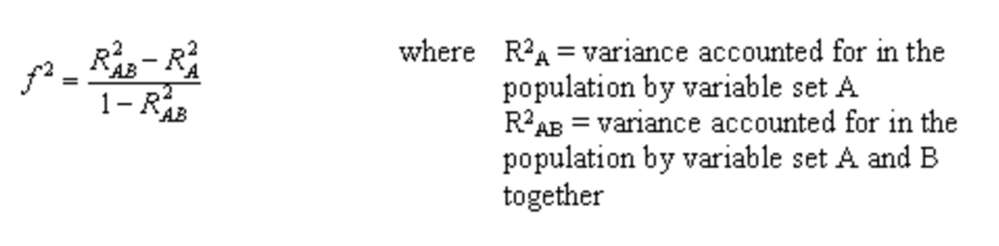

## 1 Preliminaries

In this lab we will perform linear regression on a dataset with information
about adult attachment styles and their relationship to accommodation behavior.

Predictor variables:

* Three attachment styles:
    + Secure
    + Avoidant
    + Anxious-ambivalent
* Masculinity
* Femininity

Outcome variables:

* Four accommodation behaviors:
    + Voice
    + Exit
    + Loyalty
    + Neglect

**Important:** We are going to use a custom summary function that extracts
semi-partial correlations from lm() models (this information is not provided in
R by default). To load this custom summary function run the following command in
R:

```{r}
library(foreign)
library(pwr)
source("showmelm_WB.R")
```

Now, we'll load in the data for today's lab, and we'll also remove rows that have NA values:

```{r}
d <- read.spss("attachdiag.sav", to.data.frame = TRUE)
head(d)
nrow(d) # get number of observations
d <- d[complete.cases(d), ]
nrow(d)
```

## 2 Obtaining Correlations

The correlation function in R is cor(). Let's say, for example, that we're interested in the correlation between all the predictor variables and one of our outcome variables, neglect:

```{r}
cors <- cor(d[, c("neglect", "secure", "avoid", "ambiv", "masc", "fem")], use = "pairwise.complete")
cors
```

## 3 Univariate Regression

```{r}
m <- lm(neglect ~ secure, data = d)
```

m is a special kind of object called a model object. Let's see what it contains:

```{r}
names(m)
```

We can then index into things that might be of interest, for example coefficients:

```{r}
m$coefficients
```

Like with data.frames, you can also call summary() on model objects:

```{r}
summary(m)
```

It turns out that summaries themselves are also objects! We can investigate particular aspect of the model summary like so:

```{r}
names(summary(m))
summary(m)$coefficients
```

**Question: How can we tell whether the coefficients are Bs or $\beta$s?**

## 4 Hierarchichal Regression

To conduct hierarchical regression, we'll use the same linear model function as above in the univariate case, except we add more predictors.

Now, let's see how much more variance in neglect we can explain by additionally adding another variable of interest, "avoid":

```{r}
m2 <- lm(neglect ~ secure + avoid, d)
summary(m2)
r.sq.dif <- summary(m2)$r.squared - summary(m)$r.squared 
```

### Comparing Models

We've seen that our $R^{2}$ increased from m to m2, but was this increase actually significant? We can test this using the anova() function on our two model objects:

```{r}
anova(m, m2)
```

### Obtaining Partial Correlations: showme.lm() function

You'll notice that the summary() function doesn't give you all of the information you might want from your model. For example, coefficient estimates don't give us the whole story about the actual correlations between the dependent and independent variables! (see point above about Bs vs. $\beta$s.) So, a lovely student in this class years ago developed a function called showme.lm() which will helpfully provide us with additional information, like semipartial correlations in an easy-to-digest format like summary():

```{r}
showme.lm(m2, verbose = TRUE) 
```

Now, we can see how much each independent variable uniquely contributes to variance explained in the dependent variable! In this example, secure accounts for 1% of the variance and avoid accounts for 4.9% of the variance. You'll notice that this is smaller than the total amount of variance explained by the model, 8.68%. Think back to the ballantines -- this suggests that the shared variance between secure and avoid in predicting neglect is ~2.7% (but remember that suppression means this isn't always the case!)

## 5 Stepwise Regression

Now, we'll get into doing stepwise regression. You can do this using the step() function in R. First, you fit two kinds of models. A "base" model, which includes none of your independent variables of interest, and one that contains all of them. Then, you call the step() function and specify whether you want to do backward or forward stepwise regression. 

```{r}
m.base <- lm(neglect ~ 1, d) # base model only fits an intercept
m.full <- lm(neglect ~ secure + avoid + ambiv + masc + fem, d) # full model uses all variables of interest

step(m.base, scope = list(lower = m.base, upper = m.full), direction = "forward")
```

We can see that the stepwise regression starts at the base model and then fits 5 other models that each contain one additional variable. It chooses the variable that gives the best improvement and moves on, fitting more models, until it gets to the "best" model for the data. We can also do the reverse using the backward direction in step():

```{r}
m.final <- step(m.full, scope = list(lower = m.base, upper = m.full), direction = "backward")
```

Now, the algorithm is starting from the full model. For the first step, it fits 5 different models that each contain all variables but one. Whichever variable results in the least penalty to the model is removed from consideration. This continues until the algorithm has reached a point where removing any single variable results in a significantly worse-fitting model.

## 5 Sets

In R, there's no straightforward way to encode sets into regression formulas. Rather, we'll just add in all of the variables that belong in the set we've defined.

Let's say that we want to know whether "attachment style" accounts for neglect better than "masculinity/femininity". We will fit three different models: 

* one that contains all of the predictors of interest

* one that contains only the set of attachment variables

* one that contains only the set of masculinity/femininity 

```{r}
m.full <- lm(neglect ~ secure + avoid + ambiv + masc + fem, d)
m.attach <- lm(neglect ~ secure + avoid + ambiv, d)
m.mascfem <- lm(neglect ~ masc + fem, d)
``` 

Then, we can compare the full model with each of the sub-models to determine how much each set of variable adds over & above the other set:

```{r}
## Comparing m.full and m.attach gives us the effect of adding masculinity/femininity to the model that contains the set of attachment variables:
anova(m.full, m.attach) 
summary(m.full)$r.squared - summary(m.attach)$r.squared

## Comparing m.full and m.mascfem gives us the effect of adding attachment variables to the model that contains the set of masculinity/femininity:
anova(m.full, m.mascfem)
summary(m.full)$r.squared - summary(m.mascfem)$r.squared
```

*(Notice that this method is similar to how R does stepwise regression, except we do it manually!)*

## 6 Power Analyses (Post-Hoc)

Finally, let's consider . The SPSS lab will be using an interface called PiFace, but this requires extra downloading of external software, calculating values in R which you then transfer to a separate interface, etc. In my mind, this is (a) too much work, and (b) prone to human error. Instead, we will be using the pwr.f2.test() function from the pwr library in R to compute power. We will need the following ingredients:

* Degrees of freedom in our model

* The effect size of the variable we're interested in, via this equation:



* $\alpha$: 0.05

Let's say we were interested in the power we had in detecting an effect of fem in our final model. 

```{r}
## Step 1: get df of model
df1 <- summary(m.final)$fstatistic["numdf"]
df2 <- summary(m.final)$fstatistic["dendf"]
## Step 2: get effect size of fem
r2.overall <- summary(m.final)$r.squared
r2.fem <- showme.lm(m.final)$RegressionTables$coefficients["fem", "sr2"]
f2.fem <- (r2.overall - r2.fem)/(1 - r2.overall)

power <- pwr.f2.test(u = df1, v = df2, f2 = f2.fem, sig.level = 0.05)
power
```


